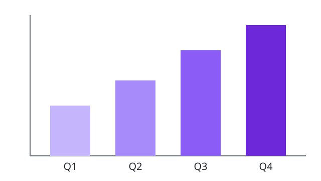

= AsciiDoc Slides: 텍스트로 만드는 발표 자료
홍길동
:revdate: 2026-10-03
:slide-theme: light
:slide-style: classic
:slide-font: Apple SD Gothic Neo
:slide-header: AsciiDoc Slides
:slide-footer: 텍스트로 만드는 발표 자료
:slide-page-numbers: true
:slide-title-page-number: false
:slide-number-start: 1

AsciiDoc으로 쓰고, PPTX와 PDF로 출판합니다.

[.notes]
--
청중에게 인사하고 오늘 다룰 내용을 소개합니다.
--

== 슬라이드 만드는 법

* `==` 제목 하나가 슬라이드 한 장
* `===` 하위 제목도 별도의 슬라이드
* 문서 제목(`=`)은 표지 슬라이드가 됩니다
** 작성자와 `:revdate:` 가 함께 표시됩니다
* `<<<` 로 같은 제목의 다음 슬라이드로 이어 쓰기

[.notes]
--
발표자 노트는 슬라이드에는 보이지 않고, PPTX의 노트 영역으로 내보내집니다.
--

[.section]
== 1부: 콘텐츠

== 텍스트 서식

*굵게*, _기울임_, `코드`, #강조#, H~2~O, E=mc^2^ 를 지원합니다.

링크도 그대로 동작합니다: https://asciidoc.org[AsciiDoc 공식 사이트]

[quote, Antoine de Saint-Exupéry]
____
완벽함이란 더할 것이 없을 때가 아니라, 뺄 것이 없을 때 완성된다.
____

== 표: 출력 형식 비교

[.small.center,width=70%,cols="2,1,1"]
|===
| 형식 | 편집 가능 | 발표자 노트

| PPTX | 예 | 예
| PDF | 아니오 | 아니오
|===

내보내기 전 상단 *Editor settings → Output quality check*에서 글자 크기·누락된 파일·선택 폰트를 점검합니다.

== 두 단 레이아웃

[columns]
--
*문제:* 한 화면에 긴 문장을 모으면 핵심을 찾기 어렵습니다.

*개선:* 문제와 해결책을 좌우로 나누면 차이를 빠르게 비교할 수 있습니다.
--

== 이미지

.분기별 매출 추이

== 다이어그램과 수식

[source,mermaid]
----
graph LR
    A[AsciiDoc] --> B[SlideDeck]
    B --> C[PPTX]
    B --> D[PDF]
----

[stem]
++++
\sum_{i=1}^{n} i = \frac{n(n+1)}{2}
++++

== 블록 크기 조절

블록 위에 역할과 속성을 붙여 크기를 정합니다.

[source,asciidoc,font-size=80%]
----
[.small,width=60%]      // 글자 80%, 너비 60%
[.large.center]         // 글자 120%, 가운데 정렬
[source,python,font-size=70%]
----

== 동영상

`video::` 로 유튜브나 로컬 동영상을 넣습니다. 발표 모드에서 재생됩니다.

[width=70%]
video::M7lc1UVf-VE[youtube]

== 알림 블록

NOTE: 슬라이드 내용이 넘치면 글자 크기가 자동으로 줄어듭니다.

TIP: 미리보기에서 슬라이드를 클릭하면 해당 소스 위치로 이동합니다.

WARNING: 원격 이미지는 내보내기에 포함되지 않습니다. 이미지 파일은 문서 옆에 두세요.

[background-image="images/background.svg"]
== 배경 이미지

문서 폴더 안의 이미지를 배경으로 사용합니다. 테마 색상을 덧씌워 텍스트 가독성을 유지합니다.

== 코드 줄 강조와 번호 설명

[source,python,highlight="2;4-5"]
----
def greet(name):
    return f"Hello, {name}!" # <1>

message = greet("AsciiDoc")
print(message) # <2>
----
<1> 이름을 넣은 인사말을 만듭니다.
<2> 인사말을 화면에 출력합니다.

`highlight="2;4-5"`는 2번 줄과 4~5번 줄을 강조합니다.

[.closing]
== 감사합니다

질문이 있으신가요?
